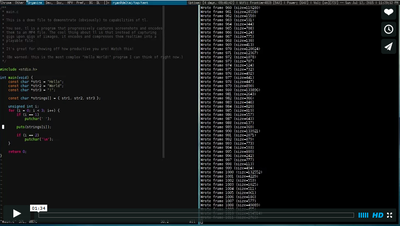

# tl
#### Painless timelapsing to show off your productivity.

**tl** progressively captures and encodes screenshots to an MP4 file. Unlike
other timelapse tools, it doesn't store thousands and thousands of images only
to encode them later. **It captures and encodes in realtime!** It is *not* going
to thrash your disk with gigs upon gigs of screenshots, and it is *not* going
to record at 30 fps when you only really need 1 fps.

It's a great way to show off how productive you are! Plus it looks cool! So
hit record and start up a coding session! Or boot up Photoshop (or more likely
Gimp) and start drawing!

[](https://vimeo.com/133315382)

(It can also be used as a decent screen recorder with: `tl -d .0333 -r 30`.)

## Downloading
#### Pre-compiled, statically linked binaries can be downloaded in the [releases](https://github.com/ryanmjacobs/tl/releases).

##### For example you can download and run v0.02:
```bash
$ wget https://github.com/ryanmjacobs/tl/releases/download/v0.02/tl-v0.02
$ ./tl-v0.02 --version
```

## Compiling from scratch
#### Download the required libraries:

##### Arch Linux:
```bash
$ pacman -S --needed base-devel libx11 ffmpeg
```
##### Ubuntu (14.04)
```bash
$ apt-get install build-essential libx11-dev libswscale-dev libavcodec-dev libavformat-dev
```

(If you know the correct packages for your distro, please submit a pull
request and I'll add it.)

#### Then just run:
```bash
$ make
$ ./tl --help
$ ./tl
```

#### To install:
```bash
$ make install
# or...
$ make install PREFIX=/usr/local
```

# Contributing
Feel free to submit any ideas, questions, or problems by reporting an issue.
Or, if you're feeling bit brave, submit a pull request. :grimacing:

## Packages
* AUR: https://aur4.archlinux.org/packages/tl/

## Todo
* Figure out how to encode an h.264 stream directly into an MP4 container.
* Recompress the video at the end. (Basically `ffmpeg -i in.mp4 -c:v libx264 out.mp4` but using the API.)
* Maybe add a GUI?
* Somehow support Mac OS X *and* Windows...
* Support drawing a capture box (or even just defining a capture box.)
* Fix the `Using 'XXX' in statically linked applications requires at runtime the shared libraries from the glibc version used for linking` warning.

## Notes
* After recording, running `ffmpeg -i timelapse.mp4 -c:v libx264 out.mp4` will
  compress the video significantly (around 75%).
* There is a C++ branch that you can checkout. I prefer to stick with C, but we
may need to move to C++ in order to support other OSes or GUIs. The C++ branch
compiles fine, but as of now, is a little out of date.

## License
MIT License - see the [LICENSE](https://raw.githubusercontent.com/ryanmjacobs/tl/master/LICENSE)

Copyright (c) 2017 Ryan Jacobs
